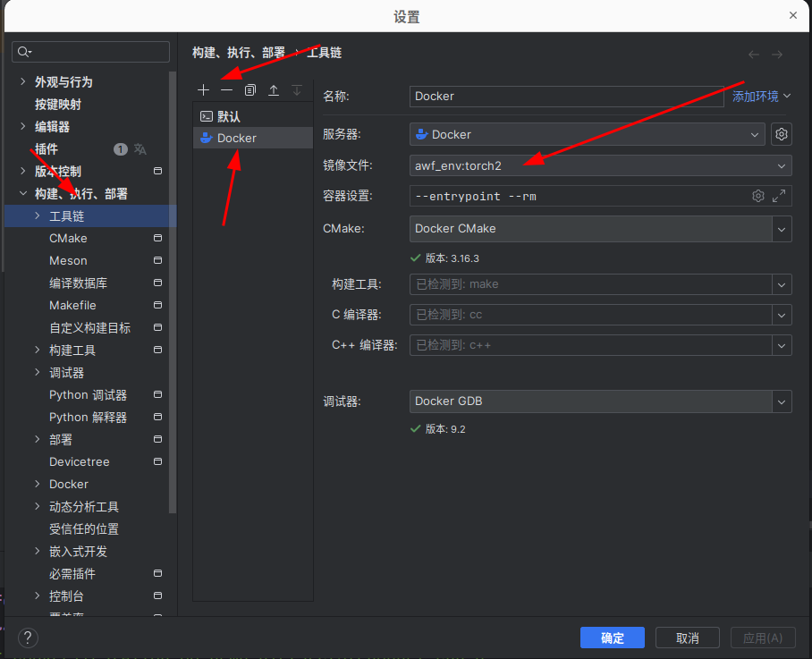
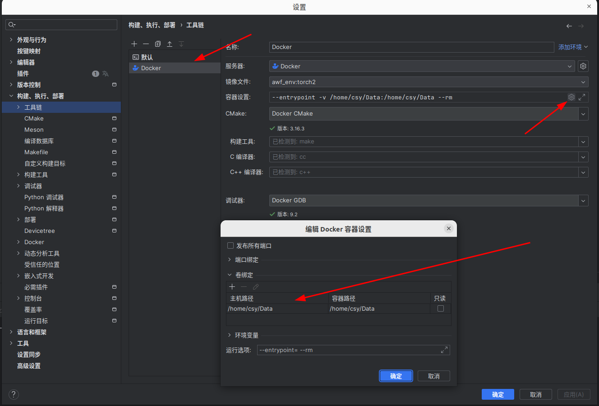

# Clion调用Docker容器作为编译环境开发C++工程

&emsp;&emsp;Clion作为C++开发的一个集成开发软件，其中插件配置相对简单，相较于Vscode仅需下载少量的扩展插件即可较好的使用，因此选择Clion作为调用Docker容器开发C++工程的IDE。

## 1. Clion载入Docker镜像
&emsp;&emsp;在Clion的设置页面，打开构建、执行、部署一栏的工具链一页，点击加号，其中有三个选项系统、远程主机、Docker，选择Docker，即将Docker环境加入到了Clion中。在Docker环境下，即可选择加载到Linux系统中的Docker的镜像，其中Docker镜像文件的命名为PEPOSITORY:TAG，可根据自己配置的Docker环境进行镜像的选择。

## 2. 工程CMakeLists.txt的更改
&emsp;&emsp;使用Docker环境后，一些Docker环境中的库，需要自己在CMakeLists中加入Docker中的相对路径，以LibTorch库为例，如果本地环境中存在Torch库了，使用本地的，如果本地环境下没有，则使用Docker环境下的下的，具体的在CMakeLists上加载的代码为
> if (EXISTS "/home/csy/Tools/libtorch_cxx11_cu113/share/cmake/Torch") \
> &emsp;&emsp;set(Torch_DIR "/home/csy/Tools/libtorch_cxx11_cu113/share/cmake/Torch") \
> else() \
> &emsp;&emsp;set(Torch_DIR "/libtorch/share/cmake/Torch") \
> endif() \
> find_package(Torch REQUIRED)
>
> target_link_libraries(ProjectName ${TORCH_LIBRARIES})

## 3. Data文件夹挂载Docker环境
&emsp;&emsp;第一步中在工具链中选择Docker镜像仅仅只将加载进本地Docker环境中的docker镜像加载到了Clion中，一般情况下，Docker在某一代码工程下，一般情况下，代码工程文件夹内不会存放数据文件夹，因此需要将本地的数据文件夹与Docker的数据文件夹同步。这时需要进行Docker容器的设置，将本地文件夹挂载在Docker容器的环境中。

&emsp;&emsp;具体操作为：在Clion的设置界面，打开构建、执行、部署一栏的工具链一页（和载入Docker镜像是同一个地方），进入加载后的Docker工具链，选择容器设置，点击旁边的设置按钮，会弹出编辑Docker容器设置小窗口，点击主机路径这一栏，可以设置本地想要和Docker容器文件夹下同步的数据文件夹；点击容器路径，可设置容器路径的路径名称，一般情况下，这两个文件夹的名称路径最好保持一致。

&emsp;&emsp;在完成这些操作后，即可在容器中调试运行自己的C++工程了。注意，整个操作建立在Docker镜像(.image)载入到本地环境之后才可以进行的操作。