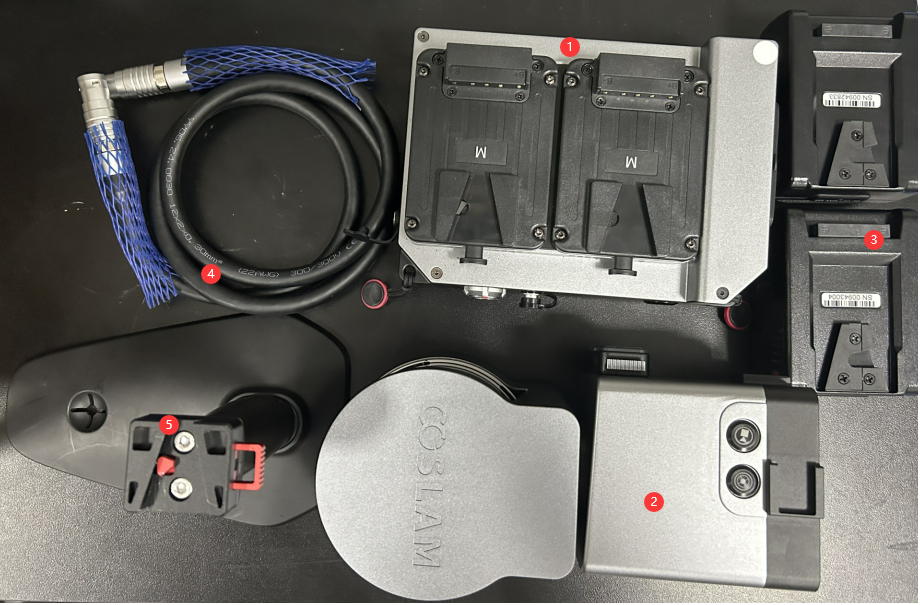
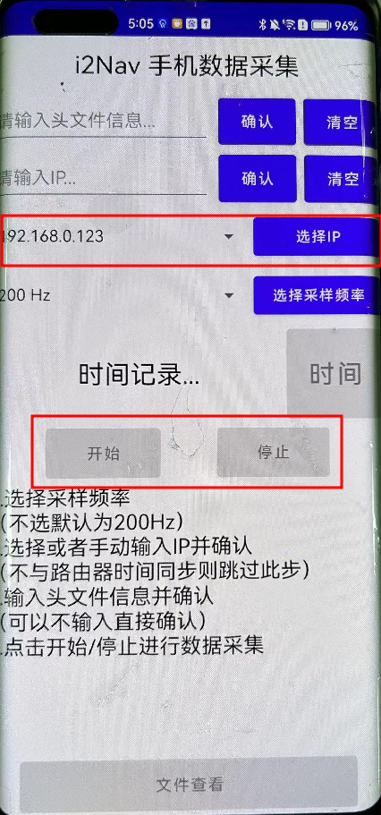
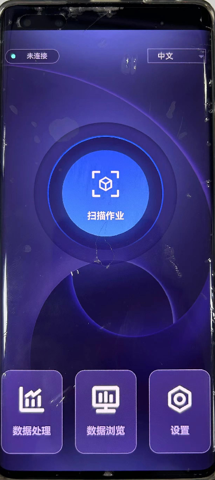

# MagDB_GOSLAM建立磁场指纹库
## 1.简介
&emsp;&emsp;本文档用于解释如何使用GoSLAM激光雷达和智能手机构建磁场指纹库。主要包括以下几个部分：设备说明、数据采集、数据处理。

## 2.设备说明
&emsp;&emsp;GoSLAM建立磁场指纹库包括使用激光雷达扫描点云生成精度较高的相对坐标，结合手机内置的加速度计、陀螺仪和磁力计，生成磁场指纹库。相较于FootMount构建磁场指纹库，激光雷达得到的相对坐标精度较高，一般不需要在自己布设控制点，同时还可以根据点云图将同一区域内的坐标进行统一。GoSLAM设备具体如图1所示。

    
    <figcaption style="text-align:center;">图1. GoSLAM设备说明 </figcaption>

&emsp;&emsp;其中，1为GoSLAM的主机；2为GoSLAM的激光雷达；3为电池电源；4为连接主机和激光雷达的连接线；5为支撑激光雷达的支架（也可以将激光雷达架在背包上）。在采集数据之前，需要先对设备的各部分进行检查，主要是检查电源还有没有电，激光雷达能否正常连接手机。一般情况下，电池充满电可使用3个小时左右。在设备检查无误后，可进行设备各部分的连接。

&emsp;&emsp;控制GoSLAM的手机软件为GoSLAM Manager。在GoSLAM的主机打开之后，可以搜到一个goslam_7263101的WiFi，密码为goslam123。在连接这个Wifi之后，可以使用GoSLAM Manager软件控制GoSLAM的开关与解算。图2（左）为GoSLAM Manager的主界面。

&emsp;&emsp;智能手机的数据采集软件为i2NavDataLogger，如图2（右）所示。其中第一个红框内需要输入对应的IP将手机与GoSLAM设备的IP同步以进行手机内置传感器与GoSLAM时间的对齐。IP地址为：192.168.0.123。第二个红框为手机传感器数据的采集。

     
    
    <figcaption style="text-align:center;">图2. 智能手机软件示意图 </figcaption>   

## 3.数据采集
### 3.1 磁场数据库构建原理
&emsp;&emsp;磁场指纹库的构建是通过一定测量手段构建磁场特征与地理坐标之间的关联性，即包括两部分：磁场特征测量和位置坐标测量两部分。

**（1）磁场特征测量**

&emsp;&emsp;环境磁场特征是通过智能手机内置的磁力计进行量测，但是由于手机中内置的磁力计传感器质量差，存在很大的零位偏置，因此需要对磁力计进行零偏的扣除。现阶段，磁力计零偏扣除手段有两种：椭球拟合和在线标定。

&emsp;&emsp;椭球拟合是指在数据采集之前，采集一组手机传感器的数据，这组传感器数据需要以用户手持手机以特定的姿势运动（即手持手机绕“8”字形转动），确保磁力计能够转动到各个方向，能有很好的几何构型。之后利用椭球拟合算法进行解算，解算出来的中心偏置即可近似看作磁力计的零偏值。之后再使用的过程中，将磁力计扣除这个零偏。

&emsp;&emsp;在线标定是指在数据采集的过程中，通过一种特定算法，在线估计磁力计零偏，以达到不需要使用特定动作即可完成磁力计的校准工作。在一般的室内环境或者半遮挡的室外环境，可以合理的认为局部区域的磁场干扰的平均值为零，即可认为在测试区域内观测到的环境磁场矢量的平均值等于地磁场矢量。且磁力计零偏在短时间内不会发生变化，因此观测到的磁场和地磁场矢量之间的关系可以描述为

$$
\begin{align}
\pmb{M^n} \approx \frac{1}{k} \sum_{i=1}^k{\pmb{C}_{b,i}^n(\tilde{\pmb{M}}_i^b-\pmb{b}_m)} 
\end{align}
$$

式中，$\pmb{M}^n$为$n$系下的三维磁场矢量，可通过查询国际地磁参考场（International Geomagnetic Reference Field，IGRF）获得；$\widetilde{\pmb{M}}_i^b$为磁力计的原始观测值；$\pmb{b}_m$为磁力计的零偏；$\pmb{C}_{b,i}^n$为$b$系到$n$系的方向余弦矩阵；$k$为磁力计的观测数量。之后，根据迭代求解水平次海沧分量，可解算得到环境磁场特征向量。具体方法如下所示：
- 磁场矢量的初始值可根据一段时间窗口的磁场观测值的平均值解算得到

    $$
    \begin{align}
    \pmb{M}_0^n \approx \frac{1}{k} \sum_{i=1}^k{\pmb{C}_{b,i}^n\tilde{\pmb{M}}_i^b} 
    \end{align}
    $$

- 基于磁力计零偏在短时间内不会改变的假设，磁力计零偏可以计算为

    $$
    \begin{align}
    \pmb{b}_{m,1} \approx \frac{1}{k} \sum_{1=1}^k{(\tilde{\pmb{M}}_i^b-\pmb{C}_{n,i}^b\pmb{M}_0^n)} 
    \end{align}
    $$
    式中,“1”为迭代次数。

- 将$b_{m,1}$带入公式4.1，即可计算得到磁场矢量$\pmb{M}_1^n$

- 重复第2步和第3步，直到满足

    $$ 
    \begin{align}
    \|\pmb{M}_{i-1}^n-\pmb{M}_i^n\| < \gamma 
    \end{align}
    $$

    式中，$\gamma$为确定算法收敛的阈值，$i$是迭代次数。$n$系下单个位置的MFS可描述为

    $$
    \begin{align}
    \hat{\pmb{M}}_i^n = \pmb{C}_{b,i}^n(\tilde{\pmb{M}}_i^b-\hat{\pmb{b}}_m)
    \end{align}
    $$

    式中,$\hat{\pmb{M}}_i^n$为估计的磁场矢量，$\hat{\pmb{b}}_m$为校准后的磁力计零偏。

**（2）位置坐标测量**

&emsp;&emsp;GoSLAM可以提供高精度的位置信息，可以辅助手机内置IMU估计磁力计的位置和姿态角。在具体数据采集时，手机与GoSLAM的激光部分通过手机支架固连，由于杆臂精度影响较小，因此可认为激光的位置近似为智能手机的位置，将此位置作为位置修正坐标，并结合手机自身IMU的INS推算，形成松组合系统，进而得到精度相对较高的手机传感器位置坐标。

### 3.2 数据采集流程

**（1）环境探测及草图绘制**

&emsp;&emsp;观察要构造的磁场指纹库周围的环境信息，绘制出环境草图，并在草图上规划行走路线，尽量确保路线能覆盖整片区域并能满足栅格数据库网的构建。

&emsp;&emsp;注意，在测试区域面积比较大的情况下，可以现在这个区域内采集一个框架点云数据，之后将这个大区域进行分块，在每一块内进行犁地采集数据。之后通过将每一块的点云与框架点云进行点云匹配，即将所有小区域内的点云以及位置统一到框架点云图中去。

**（2）进行手机磁力计的椭球拟合操作**

&emsp;&emsp;由于现在存在在线标定的磁力计零偏扣除方法，因此在实际数据采集时，这部分可以省略。这步的具体操作为：在环境内站立，打开数据采集软件i2NavDataLogger，手持手机以“8”字型转动，确保手机内置磁力计能转动到各个方向，转动时长约为半分钟。

**（3）进行仪器连接**

&emsp;&emsp;依次对GoSLAM的各部分进行连接，并用手机支架将激光头与智能手机固连。将i2NavDataLogger软件中的IP输入为192.168.0.123，在下方提示diff<10才进入时间同步稳定状态。 

**（4）GoSLAM启动**

&emsp;&emsp;手机上有一个GoSLAM管理器软件，首先需要先打开GoSLAM的主机，等待GoSLAM的内网出现，将手机WiFi连接上GoSLAM的内网。等待连接稳定后，可进入GoSLAM Manager软件，在这个软件中控制GoSLAM点云数据的采集。点击点云数据采集，即可开始GoSLAM点云数据的采集。一般情况下，GoSLAM在启动后会进行一段时间的标定，在初始化完成后才开始数据的采集。

**（5）开始手机传感器数据的采集**

&emsp;&emsp;一般情况下，最开始要先标定磁力计零偏，之后先进行手机参数配置，然后开始采集点云数据，确定一切无误后，最后开始手机传感器数据的采集。点击i2NavDataLogger软件上的开始软件，即开始手机内置传感器数据的采集，一般情况下，在开始采集时，可以先静止一会儿，等待传感器稳定下来后开始行走。

**（6）结束采集**

&emsp;&emsp;采集工作完成后，在i2NavDataLogger软件上点击停止结束手机传感器数据的采集，打开GoSLAM管理器软件，检查扫描的实时点云的情况，确认无误后，点击结束即可。

**（7）数据解算及拷贝**

&emsp;&emsp;在解算激光点云的数据时，需要先把电池给拔下来，然后连接充电器进行充电，在进行数据的解算与导出（主要是防止电池在解算过程中突然没电导致解算中断）。解算在GoSLAM管理器软件中进行，确保在解算之前主机是打开状态，并将手机WiFi与GoSLAM的内网连接。导出文件需要将U盘插入到主机上。

### 3.3 数据文件说明

&emsp;&emsp;进行磁场数据库的构建需要3个分文件夹，手机传感器数据文件夹、手机磁力计零偏标定数据文件夹、GoSLAM轨迹坐标数据文件夹。

**（1）手机传感器数据文件夹**

&emsp;&emsp;数据解算主文件夹，包括手机传感器输出的文件（sensors.txt）和GoSLAM与手机传感器时间同步文件（ntp_time.txt）

**（2）磁力计零偏标定数据**

&emsp;&emsp;在开始磁场数据库数据采集之前，手机画“8”字型转动采集的传感器数据，主要是其中的sensors.txt文件，用于磁力计零偏的椭球拟合计算。

**（3）GoSLAM解算结果数据**

&emsp;&emsp;GoSLAM扫描的点云数据和位置文件，用到的是位置文件（path.txt）。其中，GOSLAM采用的坐标系是ENU坐标系，与我们组常用的NED坐标系存在差异。且path.txt文件中输出坐标的第一列为南北朝向，因此path.txt中的坐标为南东天。在处理时需要将第一列和第三列的坐标取一个负号。

## 4.数据处理
### 4.1 点云匹配及数据拼接

### 4.2 数据处理程序说明

### 4.3 数据处理结果